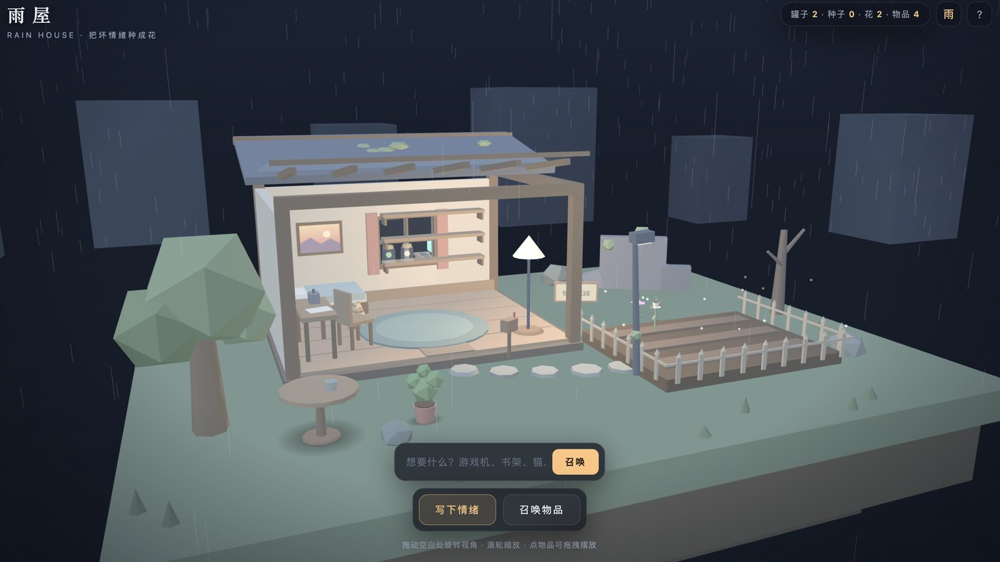
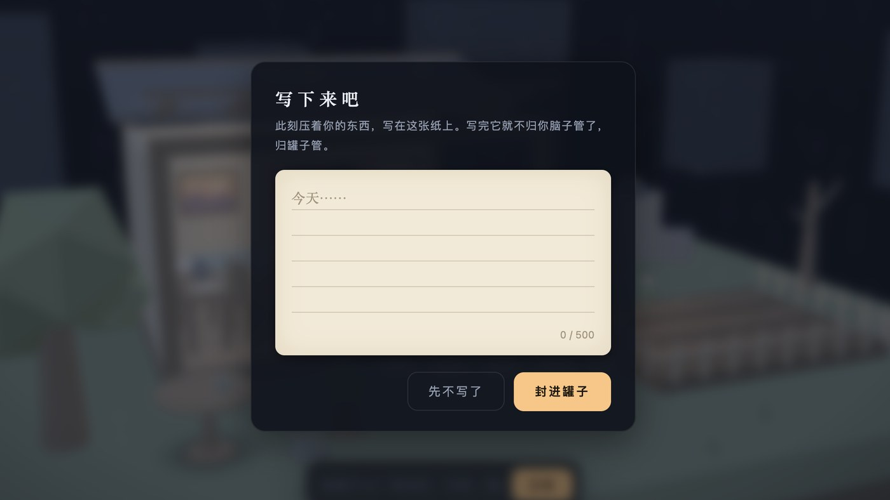
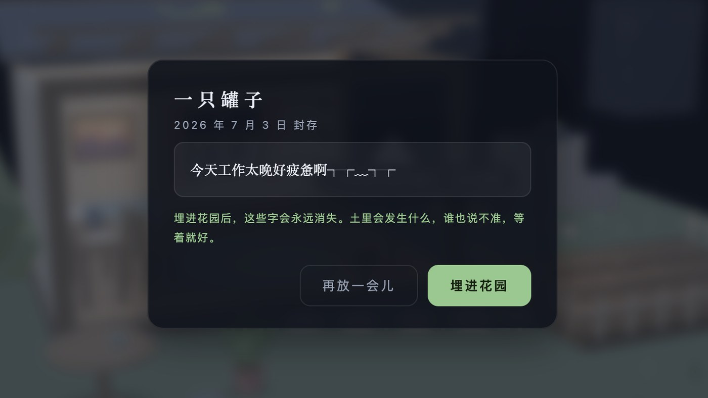

<h1 align="center">Rainhouse 雨屋</h1>

> Write down what hurts. Seal it in glass. Bury it in the ground. Leave the rest to time.
>
> 末日大雨还在下，这是你自己的房子。把坏情绪写下来，封进罐子，埋进土里——剩下的，交给时间。

  
  
  
  

  <a href="#try-it">Try It</a> ·
  <a href="#what-it-is">What it is</a> ·
  <a href="#screenshots">Screenshots</a> ·
  <a href="#features">Features</a> ·
  <a href="#privacy">Privacy</a>

Rainhouse is a quiet 3D room for one person.

Outside, it keeps raining. Inside, you can write down a bad feeling, seal it inside a glowing glass jar, and place it on the shelf. When you are ready, bury the jar in the garden soil.

The words disappear underground. Something else waits there instead: a seed, a little mystery, and maybe a rare flower carrying strange luck.

You can also summon little objects into the room: a bookshelf, a cat, a piano, a campfire, or something the game has never seen before. Bit by bit, the room becomes a small private world away from the noise.

<h2 align="center">
  <a href="https://shuyan-5200.github.io/rainhouse/">Try it · Play Rainhouse online</a>
</h2>

## What It Is

雨屋是末日废墟里一个亮着灯的房子——没有账号，没有服务器，没有人能进来，只有你。

把不想再扛着的情绪写下来，封进玻璃罐，也可以埋进花园的土里。

麻烦的情绪会永远消失，土里会留下一颗种子——说不准会开出什么花？偶尔，是一朵意想不到的惊喜之花。

如果房间太安静，就打字召唤点什么：一只猫、一台钢琴、一堆篝火，或者一件作者本人也没见过的、由你生成的谜之造物。

It is not a productivity tool, and it is not therapy. It is a tiny interactive shelter built with simple web technology.

## Screenshots

| Enter the house | Rainy little world |
| --- | --- |
|  |  |

| Write it down | Bury the jar |
| --- | --- |
|  |  |

## Features

- 把坏情绪封进会发光的玻璃罐，摆上墙架，正式告别前先陪它待一阵。
- 埋进花园，文字永远消失——没有撤销，没有备份，谁都找不回来。
- 种子什么时候成熟、会开出哪种花，都不会提前告诉你。多半是普通的花，偶尔是暴富花、锦鲤花这类只能远远期待的小惊喜。
- 打字召唤家具与生物：猫、钢琴、篝火……词库之外的任何词，都会生成一只独一无二、只属于这个词的谜之造物。
- 拖拽、旋转、收纳，把房间一点点布置成自己的样子。
- 待在一整片温柔的雨声里，远离尘嚣一会儿。
- 一个 HTML 文件，无框架、无构建、无服务器——你的浏览器，就是全部的世界。
- 所有数据只留在本机 localStorage：没有账号，没有上传，连作者本人也看不到你写了什么。

## 有些事，我不会说

种子到底要等多久，土里最终会开出哪种花，某个词召唤出的谜之造物长什么样——这些说明书故意没写清楚。因为我也不知道。就让土、雨和一点冥冥中的运气来决定吧。

## Try It

Open `index.html` directly in a browser.

Because this project is static and build-free, GitHub Pages publishes it directly from the repository root.

## Why It Is Lightweight

Rainhouse is intentionally small:

- no framework
- no backend
- no build system
- no asset pipeline
- one HTML file with HTML, CSS, and JavaScript
- Three.js loaded from CDN

That makes it easy to read, fork, remix, and learn from.

## Privacy

Everything you write stays in your own browser through `localStorage`.

Rainhouse does not upload your text anywhere. There is no server and no account system. If you switch browsers, switch devices, or clear browser data, your local rain house will not automatically follow you.

## Local Development

No install is required. Open `index.html` and refresh after editing.

The first load needs an internet connection to fetch Three.js from CDN. After the browser caches it, normal use is lightweight.

## Project Name

The Chinese name is `雨屋`.

The English name is `Rainhouse`: one small word for a house in the rain, and a place where buried feelings may bloom into something unexpected.

## License

MIT

## 写在最后

雨屋是我的第一个开源项目。它是在一个心情糟糕的夜晚，我和 Claude 一起搭起来的。

一个文件，一千多行代码，没有后端，也没打算变成什么正经产品——它就是一间小房子，希望路过的人能在里面躲一会儿这个世界的大雨。

如果有人喜欢这里，我会继续慢慢把它做下去。
